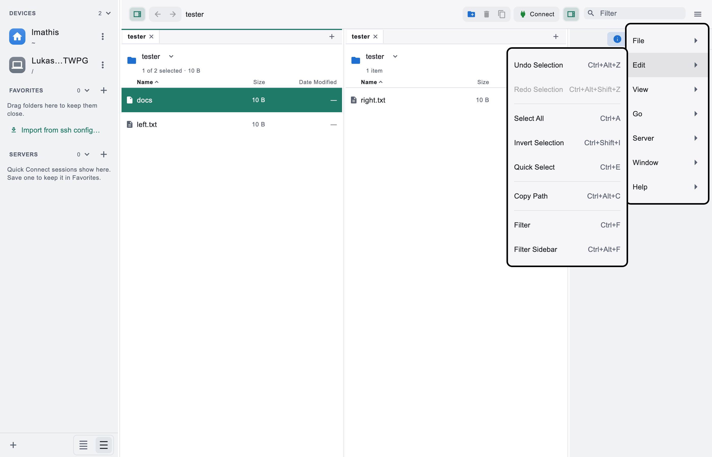
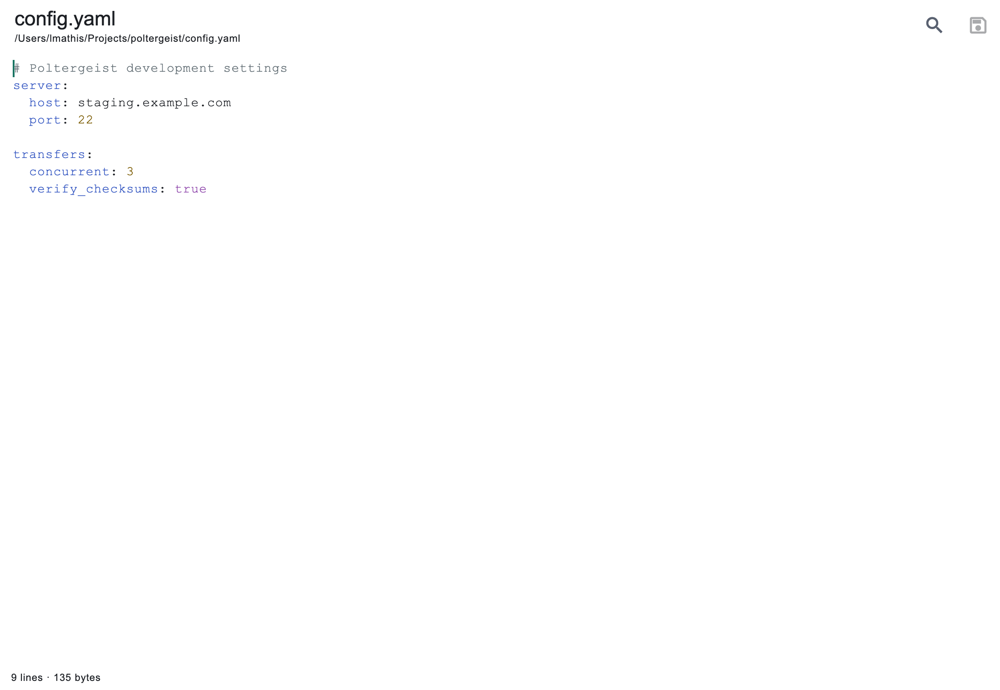
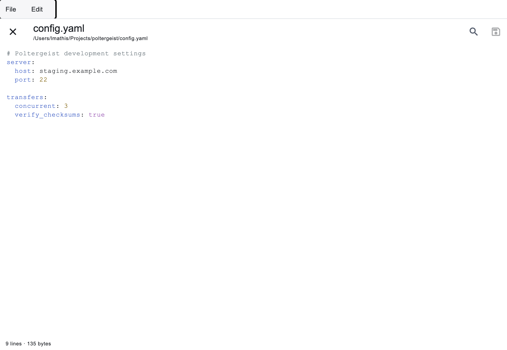

# Desktop file interactions

This change addresses the three requested interactions: a checked hidden-file
menu command, reversible selections, and independent desktop editor windows.
The behavior is recorded in plan D17, 02 §2.5, and 06 §1.

## Regression evidence

- Before the menu fix, the native menu payload omitted the checked state.
  The regression now verifies checked/unchecked payloads, pane switches,
  native menu installation order, and the corresponding AppKit item states.
- Selection regressions cover click/range/cursor restoration, undo/redo
  isolation across panes and tabs, navigation and binding rollback, deleted
  row pruning, the bounded stack, and Quick Select preview/confirm/cancel.
  Keyboard tests cover both platform shortcut families and text-field focus.
- Before the editor fix, the remote edit command left the manager with one
  workspace window and pushed a route. It now opens a separate editor and
  raises that editor on repeated opens. Integration tests save/upload and
  resolve conflicts after the source workspace is removed.
- Close/quit tests cover unsaved text, pending writes, multiple documents,
  and preventing edits or new windows during an accepted quit decision.
- A second review reproduced a native-menu save starting while the discard
  dialog was open. The close guard now rechecks the pending save after the
  dialog resolves, and the regression keeps the editor alive until it settles.
- An additional regression reproduced missing checkout upload prompts when
  an editor was the active window. The latest workspace now retains those
  app-wide reactions and presents prompts through the active navigator.

## Visual review

The screenshots are real-font widget renders in the light theme. They show
the editor content and the new selection menu; they do not show native
window borders or prove OS window placement. Computer Use could inspect the
installed application's menu, but its screenshot method returned
`Screenshot unavailable for /Applications/Poltergeist.app`.

## Native verification procedure

1. Toggle View > Show Hidden Files on and off. Confirm the macOS checkmark
   follows the active pane, including switching to another workspace.
2. Select several rows, replace the selection with one click, then run Edit
   > Undo Selection. Confirm the selected rows and range anchor return.
   Redo, switch tabs, refresh, remove a file, and repeat undo.
3. Open a local text file with Edit in Poltergeist. Confirm the workspace
   remains available in its own window. Open the file again from another
   workspace and confirm the original editor comes forward.
4. Edit a remote file, close the source workspace, then save/upload. Change
   the remote separately to verify the conflict decision belongs to the
   editor window and Cancel does not upload.
5. With unsaved documents in two windows, use native close and Quit. Cancel
   a discard decision, then confirm both documents remain editable. Repeat
   while a save/upload is pending; native close must leave that editor open.

Local native verification uses macOS. Windows/Linux builds and the complete
Flutter suite are delegated to the repository CI matrix; interactive native
Windows/Linux verification remains a manual check.
